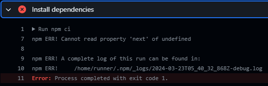

# <p align="center"> All My Bugs🕷️ | Bug🐛Log</p>
###### <p align="right">by Trent Dietzel</p>
*<p align="center">Note: Newest open bugs are listed closest to the top. WIP these are example bugs.</p>*
<p align="center">
  Status Legend:
  - ⭕ Open
  - 🚧 In Progress
  - ✔️ Solved
</p>

---
# <p align="center">Open</p>
---

---

## |▔`⭕🚧`▔|'-,🐛 Next.js | Deployment Issue with GitHub Pages
#### **<p align="center">`When attempting to deploy the site on GitHub Pages, unexpected behavior occurs`</p>**

- **Expected Outcome:** Publish successfully on GH-Pages.
- **Actual Outcome:** Deployment process halts at installing dependencies, throwing the error: "npm ERR! Cannot read property 'next' of undefined"

- **Tried:**
  - Various solutions involving 'use client', none resolved the issue.



---
# <p align="center">Solved</p>
---

## ▔`\✔️/`▔|'-,🐛 Jest #1| Testing Functions Not Recognized by Jest

#### ⚠️| **`Error Message`** | describe() and test() not being recognized when writing tests.

#### ✅| **`Solution`** | Install and save in your dev environment Jest:

```
npm i --save-dev @types/jest
```

## |▔`\✔️/`▔|'-,🐛 Next.js| Importing Component with useState
#### **<p align="center">`Importing Component with useState Results in Server Component Error`</p>**

#### ⚠️| `Error Message` | You're importing a component that needs useState. It only works in a Client Component but none of its parents are marked with "use client", so they're Server Components by default.
#### ✅| `Solution` | Add "use client" at the top of the file to signal that it's a client component:

```
'use client' // This signals that it's a client & not a server component
```
